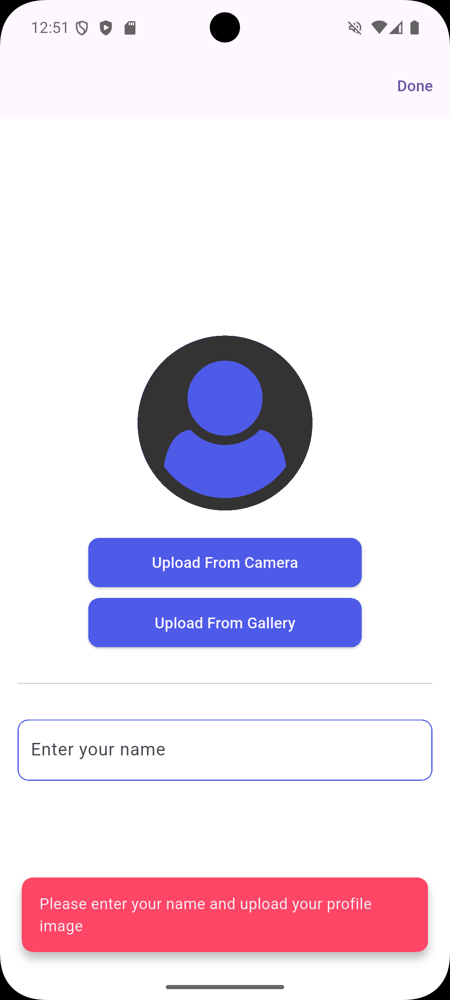
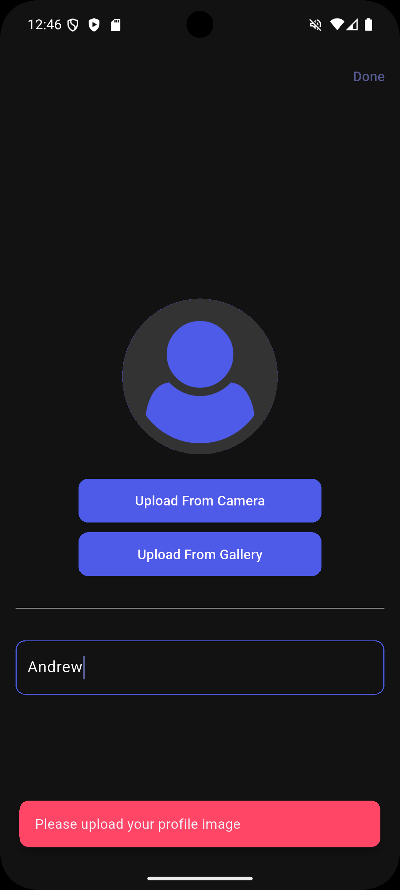
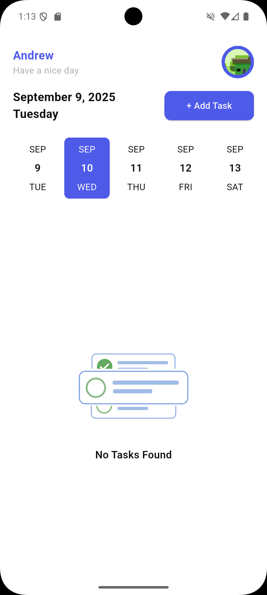
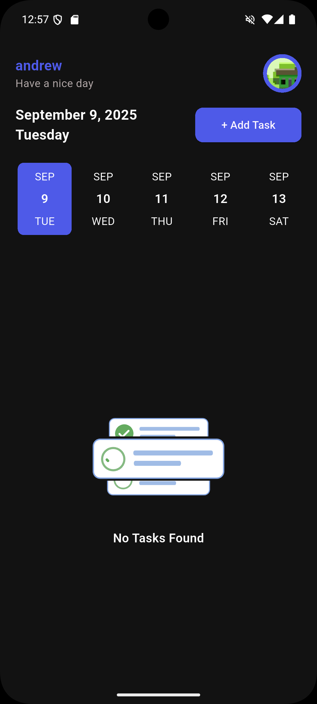
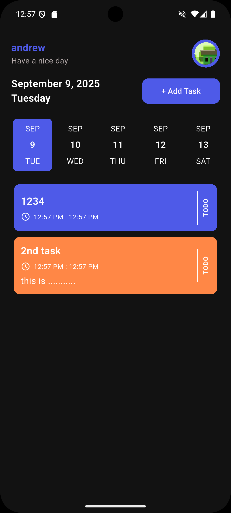
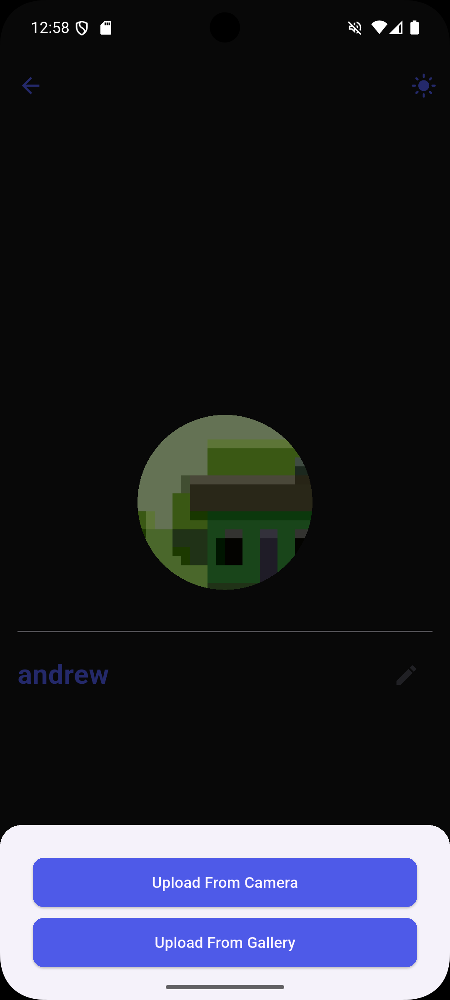
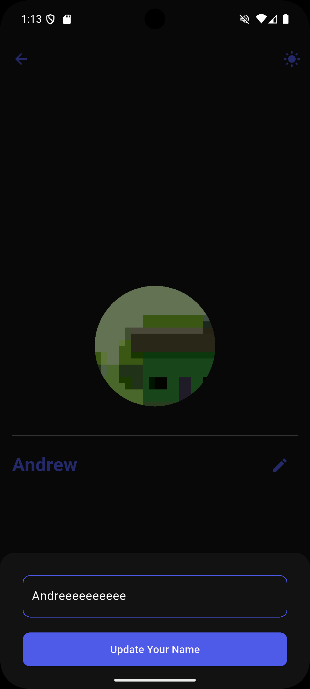

# 📌 Taskati – Task Management App  

**Taskati** is a Flutter-powered task management application built to boost productivity with a clean, intuitive, and efficient design.  
This app was created as part of the **DEPI Cross-Platform Training** program.  

---

## ✨ Key Features  

### 📝 Task Organization  
- Create, update, delete, and mark tasks as done.  
- Assign colors to tasks for better categorization.  

### 📅 Smart Scheduling  
- Built-in date picker for setting deadlines.  
- Start and end time options for tasks.  
- Daily timeline view for clear task tracking.  

### 👤 Profile & Preferences  
- Edit username.  
- Update profile picture (via camera or gallery).  
- Secure logout functionality.  

### 🌙 Theme Customization  
- Switch between light and dark modes.  
- Persistent theme setting saved locally.  

### 💾 Offline Storage  
- Data saved locally with **Hive** for seamless offline use.  

### 🎬 User Experience  
- Animated splash screen and signup process.  
- Engaging Lottie animations for empty states.  
- Responsive UI designed for both mobile and desktop.  

---
## 📸 Screenshots  

  
  
  

  
  
  

  
  
  

---

## 🔌 Plugins Used  
- **Hive & hive_flutter** – Local NoSQL database  
- **Image Picker** – Capture or select images from gallery/camera  
- **Intl** – Internationalization & date formatting  
- **Lottie** – Display Lottie animations  
- **Gap** – Simple spacing widgets  
- **File Selector** – Native file picker for desktop  
- **Flutter SVG** – Render SVG images  

---
